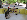
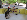
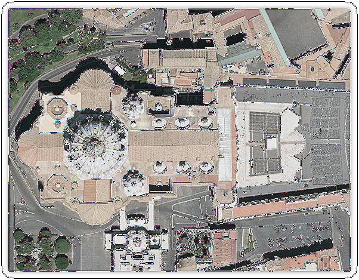

## Progress Log

### Task 1.1 | Nearest-neighbour Interpolation + Resize

`dog4x-nn.jpg`  

`dog7th-nn.jpg`  

### Task 1.2 | Bilinear Interpolation + Resize

`dog4x-bl.jpg`  

`dog7th-bl.jpg`  

### Task 2.1 + 2.2 | Box Filter + Convolution

`dog-box7.jpg`  

`dogthumb.jpg`  

### Task 2.25 | Cannyedge (EXT) + HighPass, Sharpen & Emboss filters

(Custom test image)

`bldg-highpass.jpg`  

`bldg-sharpen.jpg`  

`bldg-emboss.jpg`  

`bldg-canny.jpg`  

### Task 2.3 | Gaussian Kernel

`dog-gauss2.jpg`  

`dog-gauss2-big.jpg`  

### Task 3 | Hybrid Images

Low freq `low-frequency.jpg`  

High freq `high-frequency.jpg`  

Reconstruction `reconstruct.jpg`  

